## 安装
1. [IDE下载](https://developer.harmonyos.com/cn/develop/deveco-studio#download)
2. 一直下一步
3. 创建图标，环境变量如下图

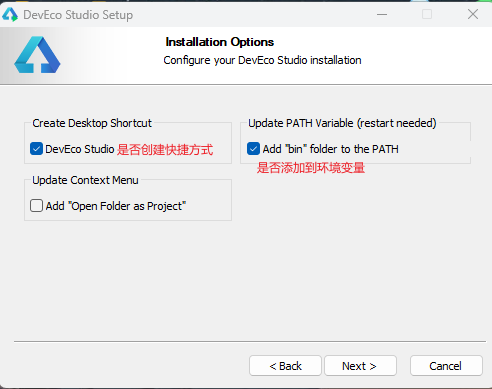  
4. 直接install安装

## 配置

5. 打开ide配置同意协议
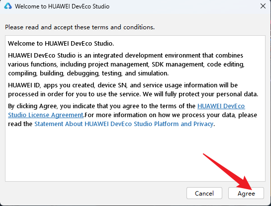  

6. 首次安装

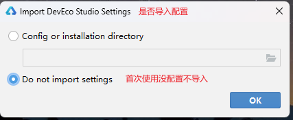  

7. 基本环境安装
   
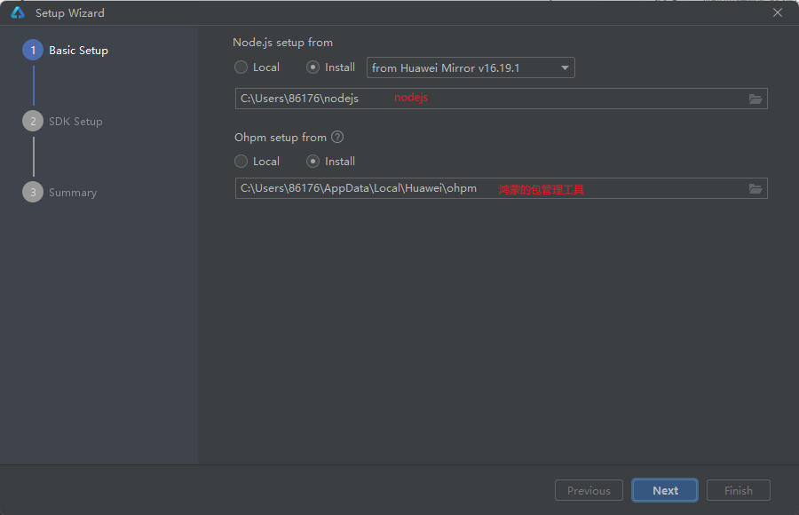  

8. sdk安装

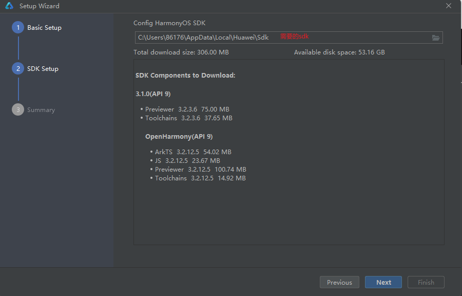  

9. 每个sdk都同意协议

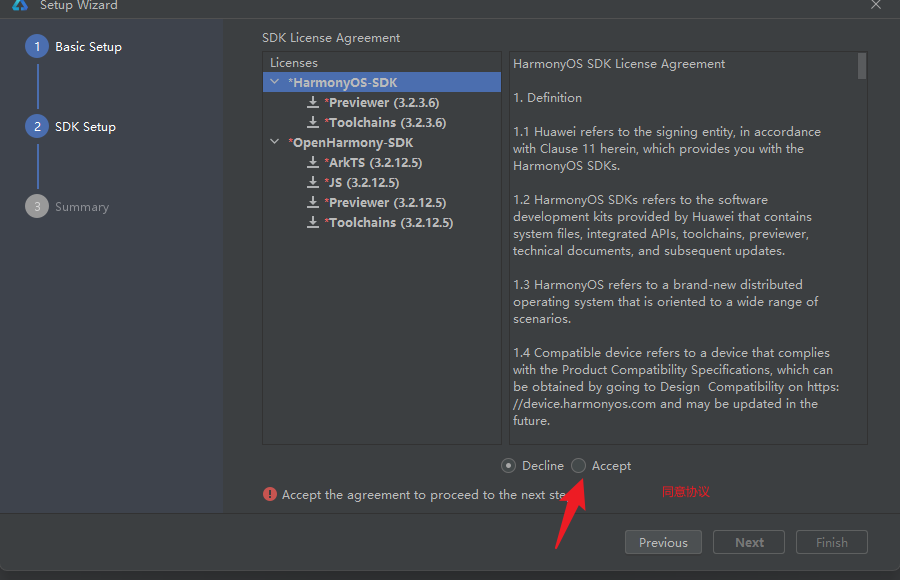  

10. next 等待安装完成

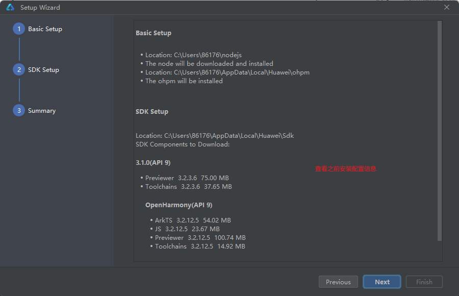  

## 问题
1. 安装sdk失败
   
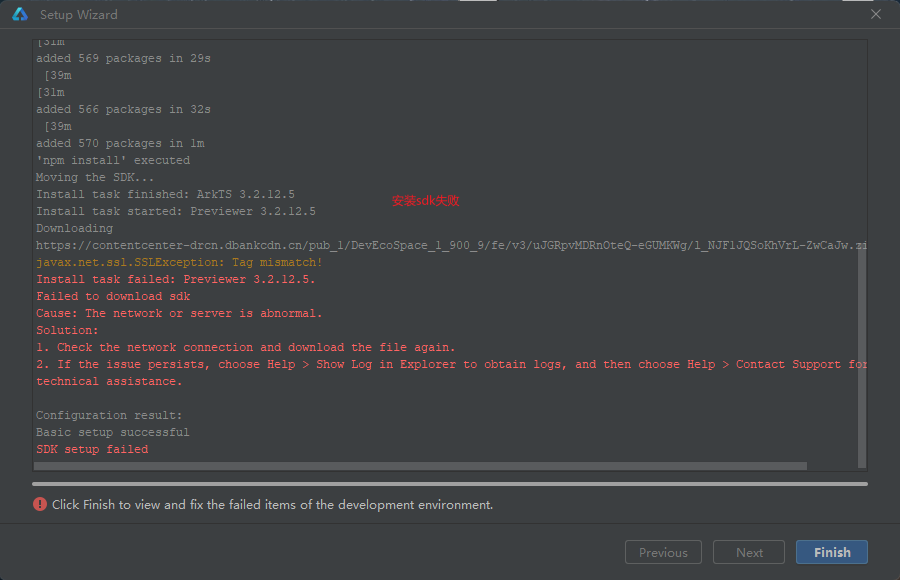  

2. 打开配置

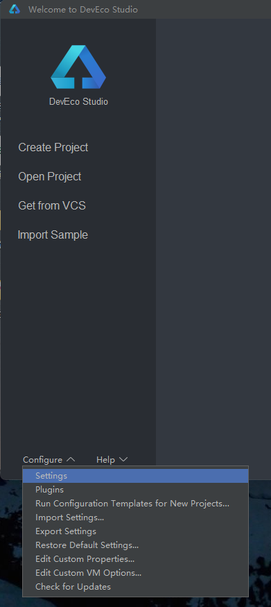  

3. npm换源(1)
   
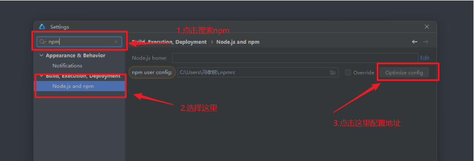  

4. npm换源(2)
   
``` js
https://registry.npmjs.org/
```   
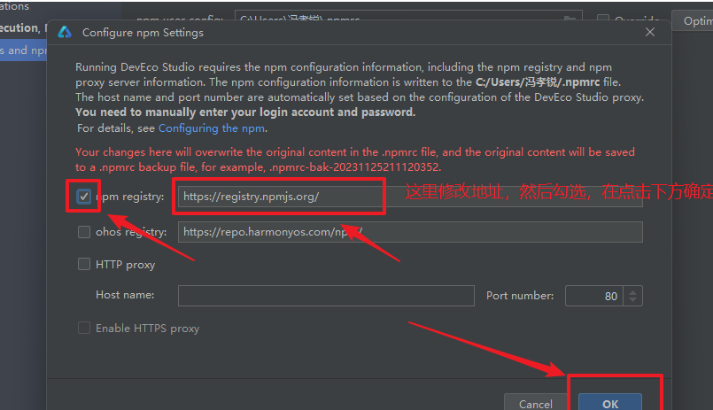  

1. 重新安装sdk
   
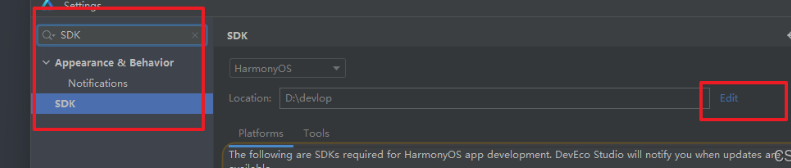  