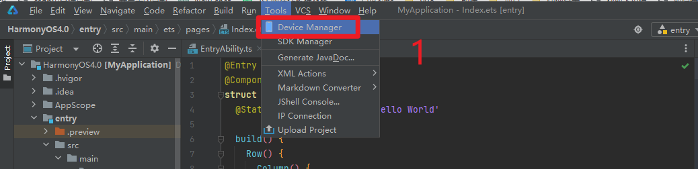
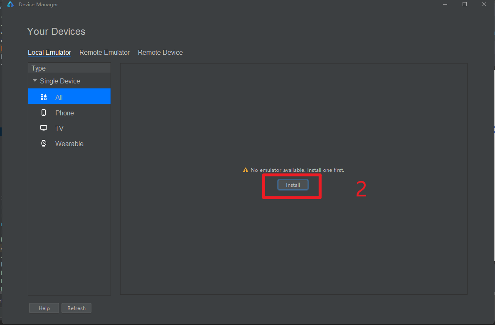
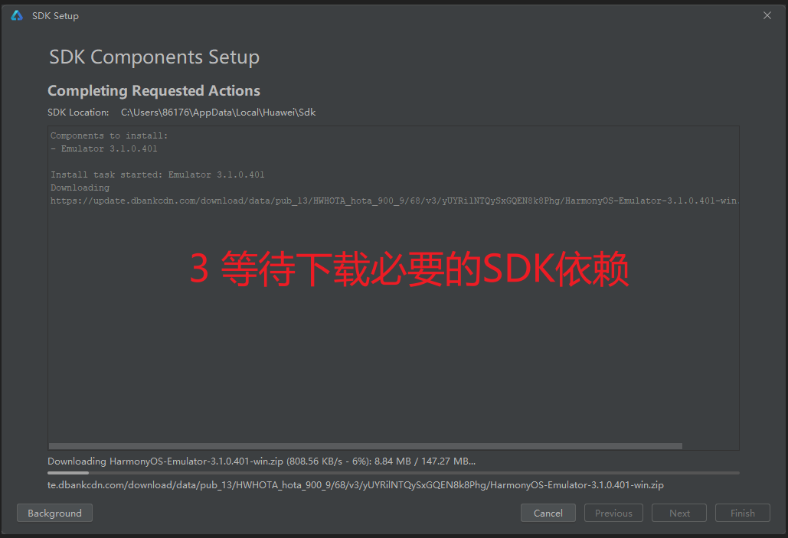
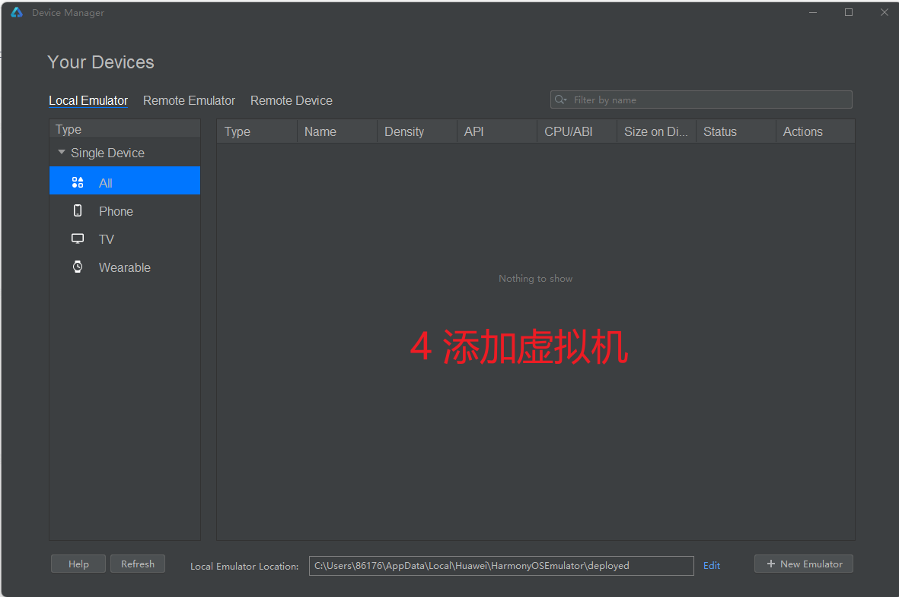
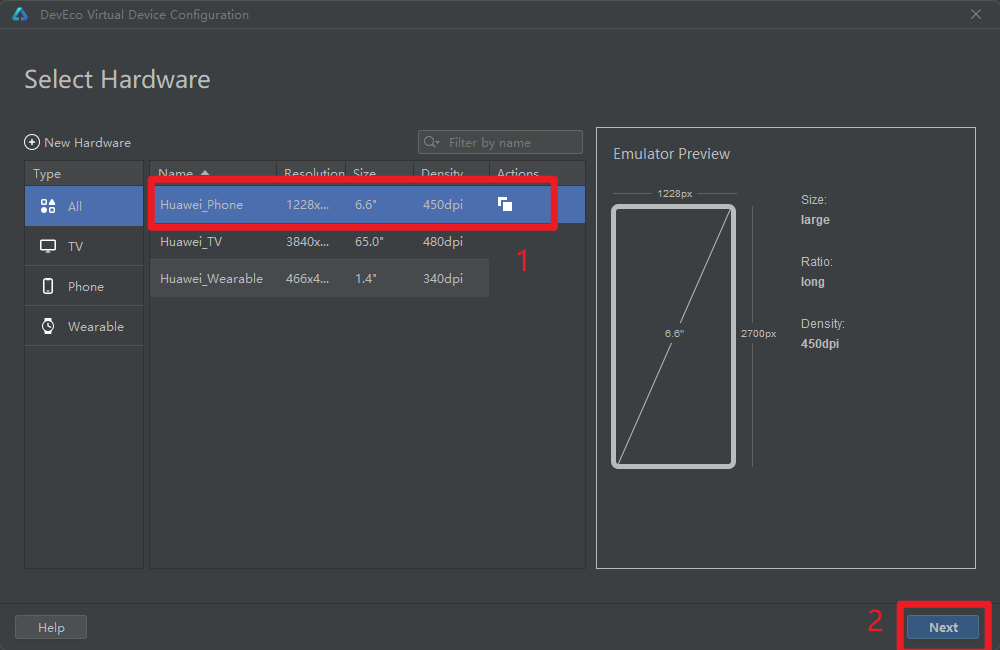
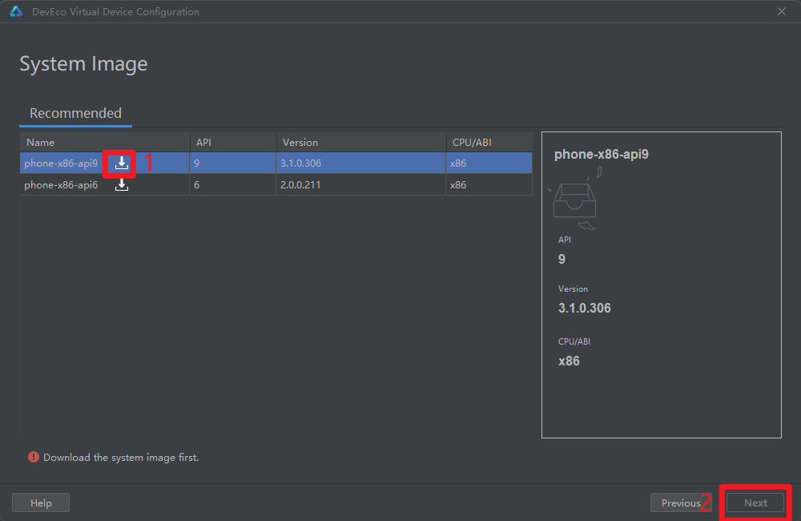

## 安装模拟器
利用设备模拟器来查看更真实的效果。不过需要先配置模拟器。步骤如下
  
  
  
::: warning 注意
如果sdk安装失败

把原来npm仓库 https://repo.huaweicloud.com/repository/npm/ 改为 https://registry.npmjs.org/
[详见IDE安装及配置文档问题 换源npm](./IDE安装及配置.md#npm-question)
:::

等待一段时间的下载之后，选择Finish。
进入创建模拟器页面，选择New Emulator：

  
  
  