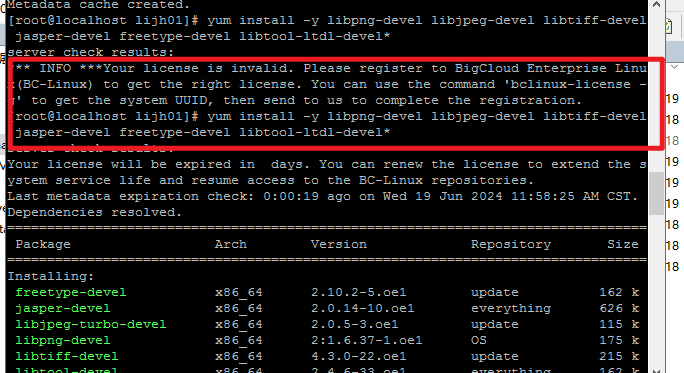
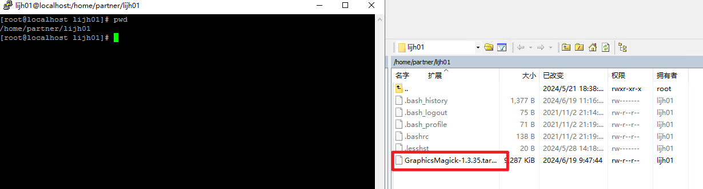
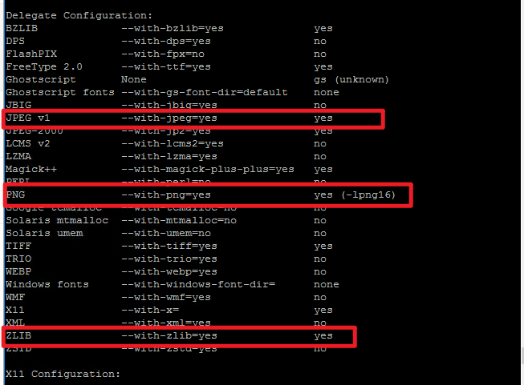
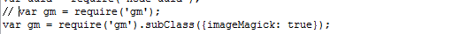

### 1. libpng和libjpeg等图片开发包的安装

```
yum install -y libpng-devel libjpeg-devel libtiff-devel jasper-devel freetype-devel libtool-ltdl-devel*
```

如果报错一直试或者清理一下在试 直到完成安装

```
sudo yum makecache
```



### 2. 查询当前所在目录 将GraphicsMagick-1.3.35.tar.gz复制到该文件内

```
pwd
```



### 3.解压 GraphicsMagick-1.3.35

```
tar -zxvf GraphicsMagick-1.3.35.tar.gz
```

### 4.查看是否符合条件

```
cd GraphicsMagick-1.3.35
```

```
./configure

在执行完上述命令后会有一段输出，可以查看GraphicsMagick支持的图片格式yes的表示为支持，PNG、JPEG v1和ZLIB必须为yes，若不为yes将按照前提中所写的进行操作，然后再重复执行【步骤1】中的命令，一直到全部支持为止，否则将无法正常进行截图操作
```



### 5. 编译安装gm

```
make && make install
```

### 6. 配置环境变量

```
vim /etc/proflie  
```
添加下面配置
```
export GMAGICK_HOME="/usr/local/GraphicsMagick-1.3.35" 
export PATH="$GMAGICK_HOME/bin:$PATH" 
LD_LIBRARY_PATH=$GMAGICK_HOME/lib:$LD_LIBRARY_PATH 
export LD_LIBRARY_PATH 
```

```
:wq 保存并退出
```

使配置环境生效

```
source /etc/profile  
```

### 7. 使用命令查看GraphicsMagick所支持的图片格式： 

```
gm convert -list formats 
```

如果列表中如果显示PNG、JPEG、GIF等则表示已支持图片转换

### 8.测试安装是否正常，使用如下命令：

```
gm convert -resize 100x80^ -gravity Center -crop 100x80+0+0 1.jpg thumb.jpg 
```

```
命令说明
gravity 表示中心坐标，可选值为 Center , NorthWest(左上), NorthEast(右上), SouthWest(左下), SouthEast(右下) ，由Center参数即由中心开始向两边裁剪，+指定x轴向y轴向的偏移量。sample.jpg/png为要裁剪的图片且必须存在，thumb.jpg/png为裁剪后生成的新图片，可以拷贝生成的文件到本地后查看，能正常显示，则说明所有安装均正常。
```

###  9. 修改服务

```
app/sys/service/app/uploadAttachByHttp.js
引入修改
var gm = require('gm'); 变为 var gm = require('gm').subClass({imageMagick: true});
```



### 附件

```
https://pan.baidu.com/s/1h6xcux1hQsY76-IExgjR4Q?pwd=vxki
```

